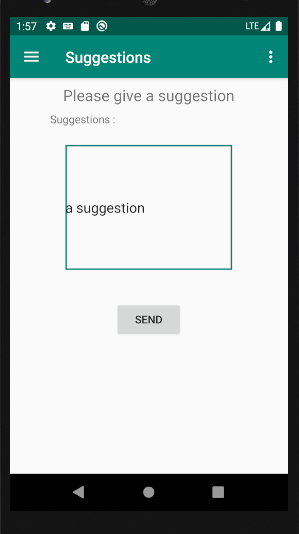

# Risk Registration App

Android application built using Java, Kotlin, MySQL Database for risk registration. Database helper is created to store the risks but commented out during build phase for fast performance.

## Description
Risk Registration App is an one easy tool accessible for everyone Risk, Event, Incident, Complaint Registration. Risk is everywhere. There are some risks that might occur while some that already occured. Not all the risks are registered and acted upon and a lot of risks are not even reported. Hence, it is important that there is a platform to register them first so that further actions can be taken up. 

The android application has login screen followed by Risk Registration and features like share the risk, initiate payment, give suggestion, emergency contact numbers to be called and general awareness.
The idea is to provide a gamification platform for users who register risk. For every risk registered users get points which can be later rewarded by the organization. The user only gets points once the registered risk is verified by the organization. When a risk the impact on costs above 1000$ is registered, notification is sent to the risk management team to check. 

## Screens

##### Login Screen

##### User Profile

##### Register Risk

##### Upload Image

##### Submit Risk

##### Share Risk

##### Suggestion

## Installation

Following softwares were used to run this application

- Android Studio 3.5.1 or IDE with android supported plugin
- Emulator - This project was tested using "Nexus 5 API 29" as an Emulator
- Android OS - Android Pie

The project is builg using Gradle

## Features to be implemented for v2.0:

- Retreiving and overview of registered risks
- Providing points to user
- Notification and approval for registered risks
